# 🛒 PC Shopping Application

A simple and user-friendly **E-commerce Android Application** developed using **Flutter & Firebase**, where users can browse, buy, and track their orders related to PC components and gadgets.

## 🚀 Features

- 📱 Clean & Attractive UI
- 🔍 Browse PC components & gadgets
- ❤️ Add products to Wishlist
- 🛒 Secure Payment Integration via **Razorpay**
- 🚚 Real-time Order Tracking
- 🔄 Real-time Database Sync for smooth performance
- 📂 Firebase Authentication & Database

## 🛠️ Tools & Technologies

- **Flutter**
- **Firebase**
- **Razorpay Payment Gateway**

## 📸 Screenshots

| Login Screen |
|------------|--------------|---------------|

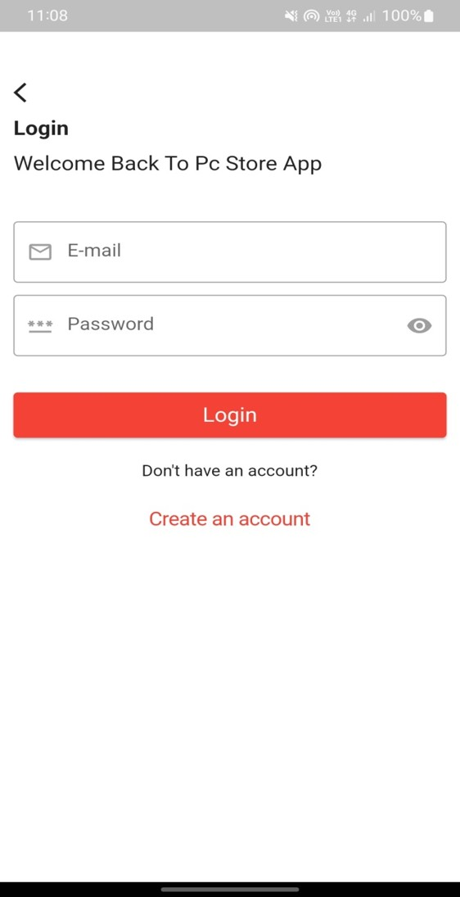
| Home Screen |
|------------|--------------|---------------|

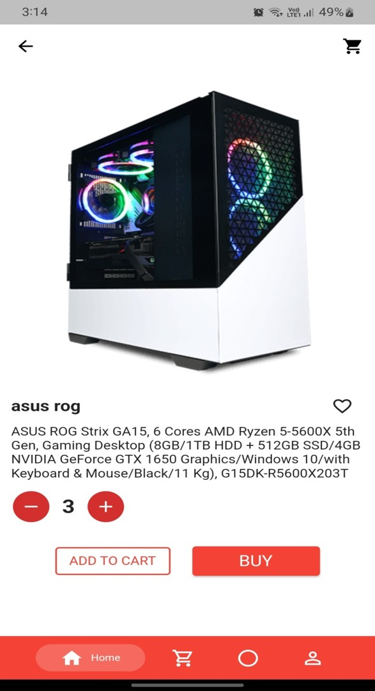
| Searching |
|------------|--------------|---------------|
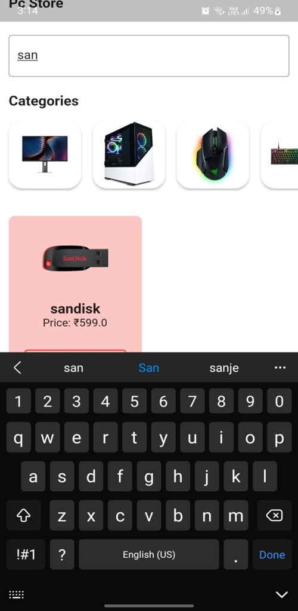
| Wishlist |
|------------|--------------|---------------|
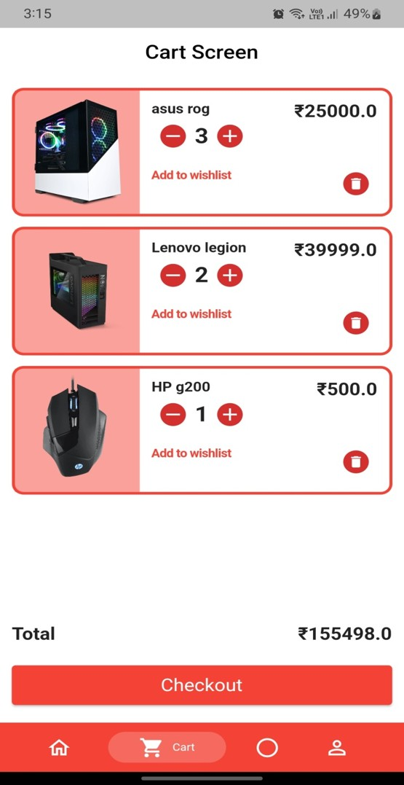
| Payment & order details |
|------------|--------------|---------------|
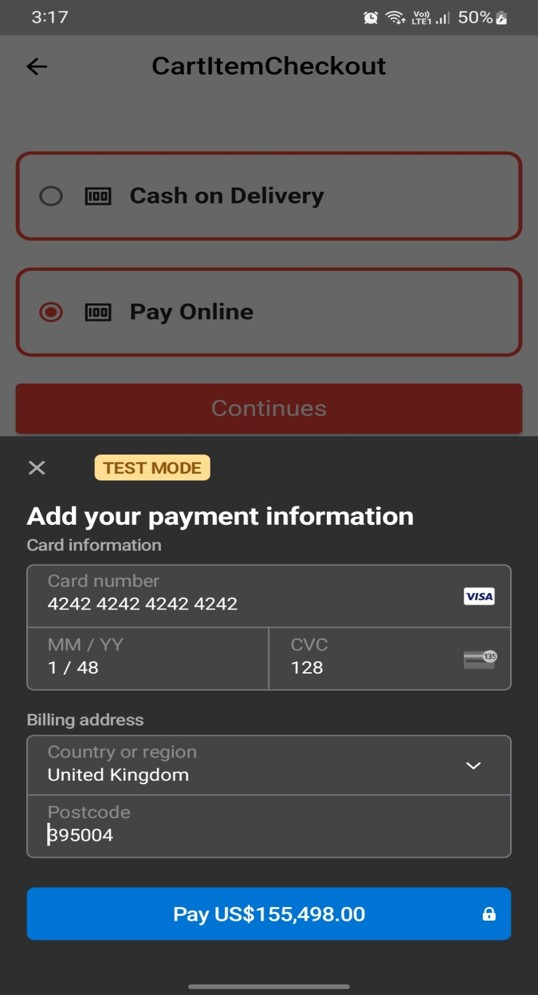
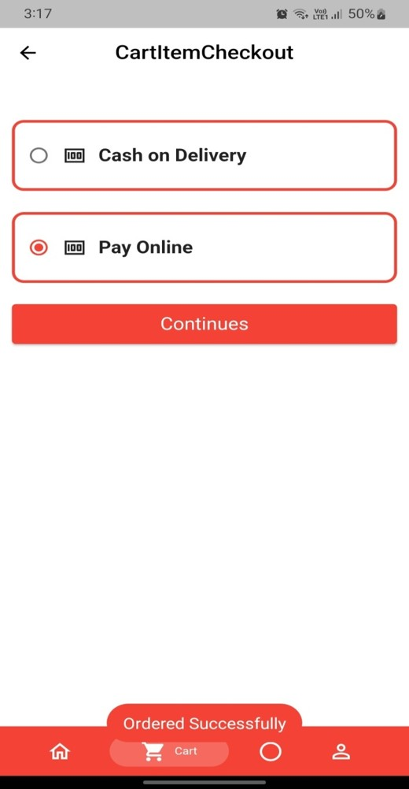
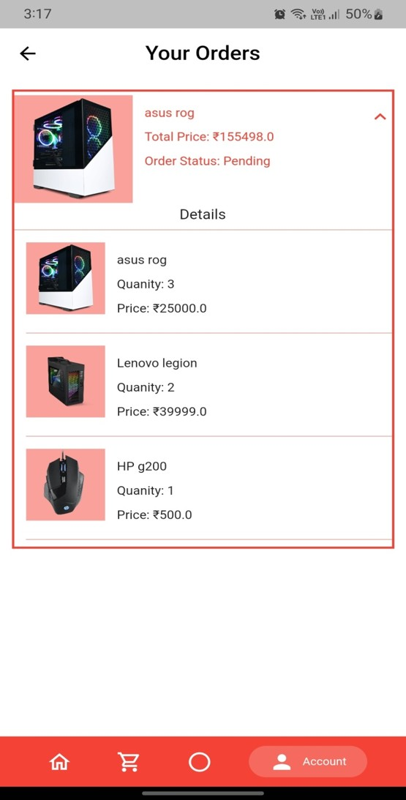
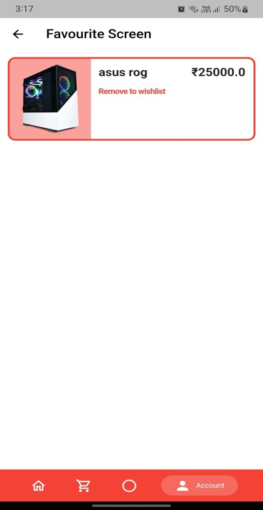
|Profile|
|------------|--------------|---------------|
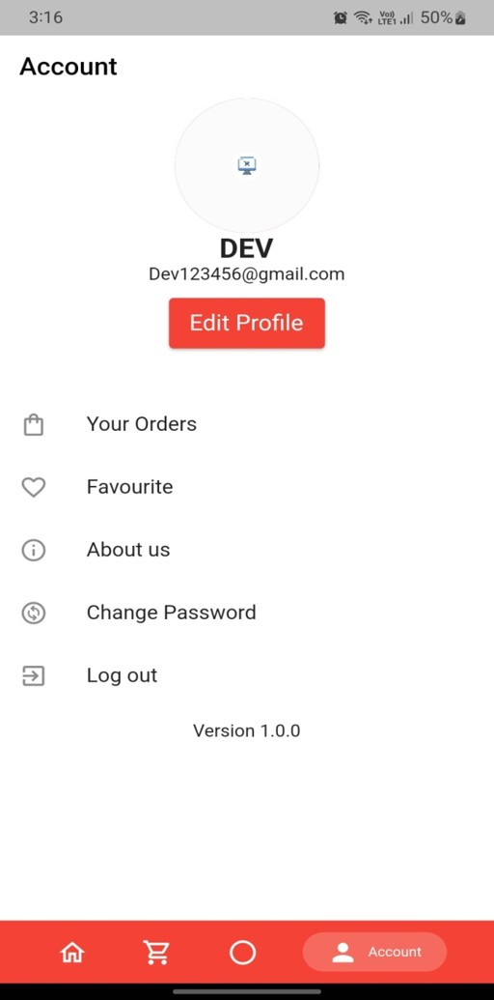
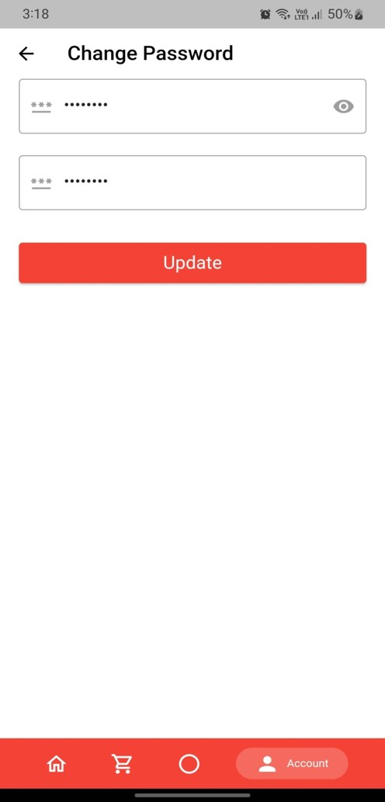
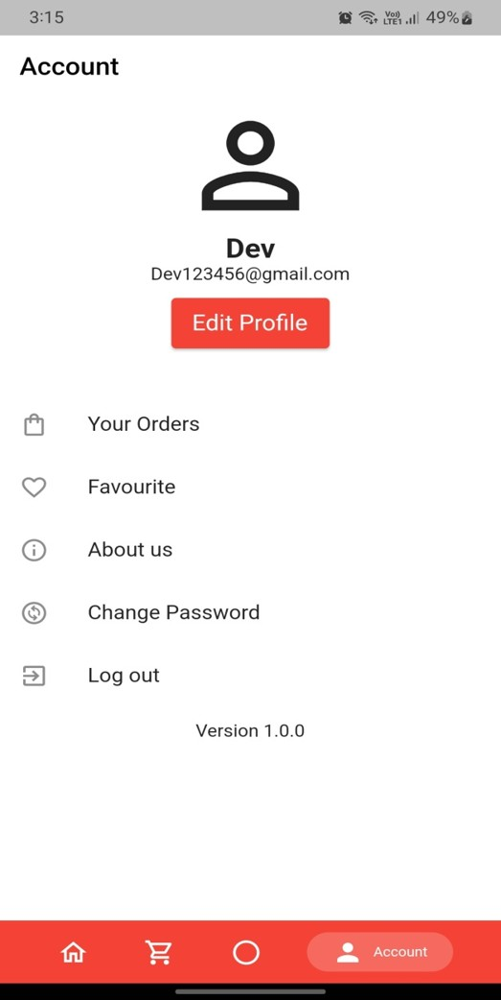
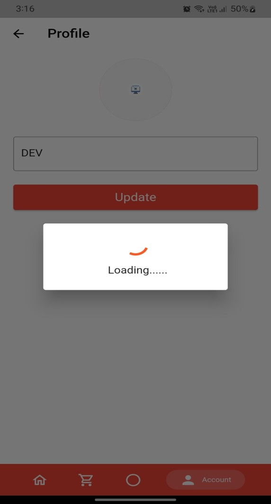

## 📌 How to Run

1. Clone the repository
2. Open the project in **Android Studio / VS Code**
3. Run `flutter pub get`
4. Set up your **Firebase Project** and add `google-services.json`
5. Run the project on Emulator or Physical Device

## 🤝 Contributing

Pull requests are welcome. For major changes, please open an issue first to discuss what you would like to change.

